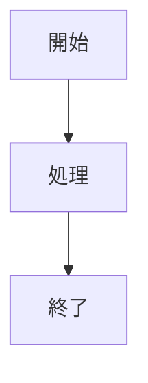

# 生成AI時代のドキュメント基盤 ~ 金融SIでの実践事例紹介 ~

（250文字以内）

生成AIの活用が進み、AWSからKiro、GitHubからSpec Kitが登場し、仕様駆動開発が注目されています。

これらはMarkdownをgitで管理しますが、実運用には課題が多く存在します。

図表は何で描くか？プレゼン資料は？検索含め、どう閲覧しやすく共有するか？納品が必要な場合に対応可能か？

私たちは金融SIプロジェクトで、7年間800ページを超えるドキュメントで仕様駆動開発をしてきました。

それを支えたドキュメント基盤を、同じ課題に直面している方々に共有いたします。

## リポジトリー外部リソース

- デモサイト：[https://mango-water-099741f10.3.azurestaticapps.net/](https://mango-water-099741f10.3.azurestaticapps.net/)
- プレゼン資料：T.B.D

## 技術スタック

- Markdown
- **[MkDocs](https://www.mkdocs.org/)**: 静的サイトジェネレーター
- **[Material for MkDocs](https://squidfunk.github.io/mkdocs-material/)**: レスポンシブテーマ
- **[Mermaid](https://mermaid.js.org/)**: 図表描画ライブラリ

## 利用ツール


## 📋 概要

このプロジェクトは、システム開発におけるドキュメンテーション戦略を実践的にサポートするためのリソース集です。MkDocsとMermaidを活用して、以下のような技術ドキュメントのサンプルを提供しています：

### 📊 提供している図表サンプル

- **システム設計ドキュメント**
  - システム概要（フローチャート）
  - システムアーキテクチャ（コンポーネント図）
  - データベース設計（ER図）
  - クラス設計（クラス図）

- **プロセス・フロードキュメント**
  - ユーザージャーニー（シーケンス図）
  - 状態管理（状態遷移図）

- **プロジェクト管理**
  - プロジェクト計画（ガントチャート、マイルストーン）

## 🛠️ 技術スタック

- **[uv](https://docs.astral.sh/uv/)**: Python環境・パッケージ管理
- **Python 3.13**: 実行環境

## 🚀 セットアップ

### 前提条件

- Windows 10/11
- PowerShell 5.1 以上
- インターネット接続（パッケージダウンロード用）

### 自動セットアップ

管理者権限でPowerShellを起動し、以下のコマンドを実行してください：

```powershell
.\scripts\Setup-Environments.ps1
```

このスクリプトは以下を自動でインストール・セットアップします：

- Python 3.13
- uv（Python環境管理）
- Node.js
- Mermaid CLI
- GTK+ Runtime（PDF生成用）
- プロジェクト依存関係

### 手動セットアップ

1. **リポジトリのクローン**
   ```bash
   git clone <repository-url>
   cd DocumentationStrategy
   ```

2. **Python環境のセットアップ**
   ```bash
   uv sync
   ```

3. **開発サーバーの起動**
   ```bash
   uv run mkdocs serve
   ```

4. **ブラウザでアクセス**
   ```
   http://localhost:8000
   ```

## 📝 使用方法

### ローカル開発

```bash
# 開発サーバー起動
uv run mkdocs serve

# 本番ビルド
uv run mkdocs build

# PDF生成
uv run mkdocs build --config-file mkdocs.yml
```

### ドキュメント編集

1. `docs/` ディレクトリ内のMarkdownファイルを編集
2. Mermaid図表は、コードブロック内で `mermaid` 言語を指定
3. 変更は自動的にライブリロードで反映

### 新しい図表の追加

```markdown

```

## 📁 プロジェクト構造

```
DocumentationStrategy/
├── docs/                          # ドキュメントソース
│   ├── 01.システム設計/           # システム設計関連
│   ├── プロセス・フロー/          # プロセス図表
│   ├── プロジェクト管理/          # プロジェクト管理図表
│   ├── stylesheets/               # カスタムCSS
│   └── index.md                   # トップページ
├── scripts/                       # セットアップスクリプト
├── mkdocs.yml                     # MkDocs設定
├── pyproject.toml                 # Python依存関係
└── README.md                      # このファイル
```

## 🔧 設定

### MkDocs設定（mkdocs.yml）

主要な設定項目：

- **テーマ**: Material for MkDocs（日本語対応）
- **プラグイン**: 
  - `mermaid-to-image`: PDF出力用の図表変換
  - `to-pdf`: PDF生成機能
- **拡張機能**: Mermaid図表サポート、コードハイライト

### Python依存関係（pyproject.toml）

- MkDocs関連パッケージ
- PDF生成用ライブラリ（WeasyPrint）
- Mermaid図表処理プラグイン

## 📄 PDF出力

ビルド時に自動的にPDFが生成されます：

```bash
uv run mkdocs build
```

生成されたPDF: `site/pdf/ドキュメンテーション戦略.pdf`

## 🤝 コントリビューション

1. このリポジトリをフォーク
2. フィーチャーブランチを作成
3. 変更をコミット
4. プルリクエストを送信

## 📜 ライセンス

MIT License - 詳細は [LICENSE](LICENSE) ファイルを参照してください。

## 🆘 トラブルシューティング

### よくある問題

1. **PDF生成エラー**
   - GTK+ Runtimeがインストールされているか確認
   - WeasyPrintの依存関係を確認

2. **Mermaid図表が表示されない**
   - ブラウザのキャッシュをクリア
   - JavaScriptが有効になっているか確認

3. **セットアップスクリプトが動作しない**
   - PowerShellを管理者権限で実行
   - ExecutionPolicyを確認

### サポート

問題が発生した場合は、GitHubのIssuesで報告してください。